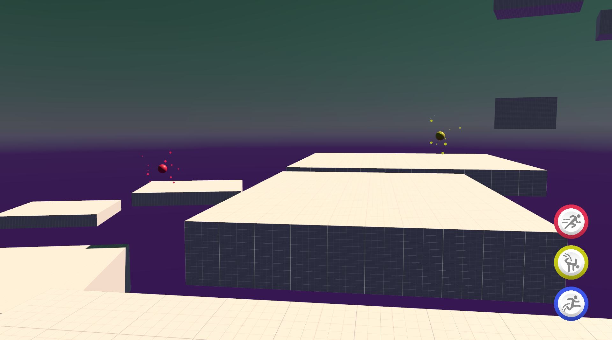
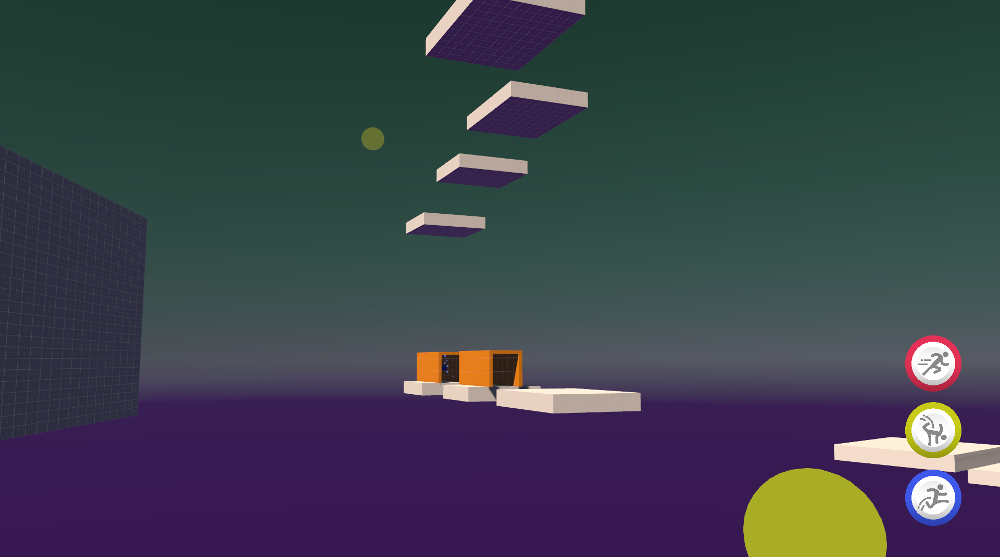
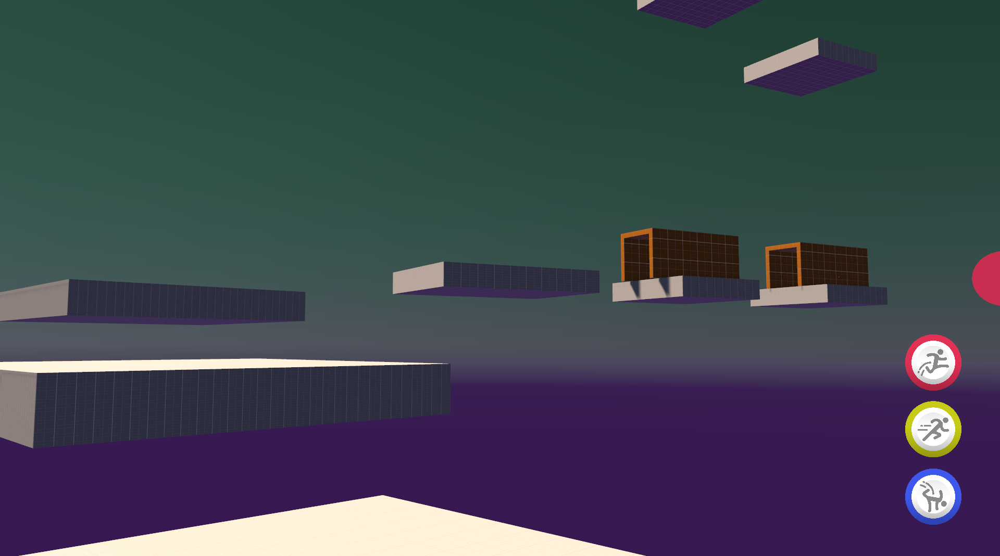

# RGBuddies

You are in a computer simulation and have to reunite disconnected RGBuddies. Hop between characters and reverse their roles. RGBuddies have 3 abilities: 

- DOUBLE JUMP
- DASH
- LOW-GRAVITY

Goal of each level is to group all characters together.  Game is parkour oriented and has speedrunning potential. Currently there are two levels but they can be finished in multiple ways.

## Screenshots

